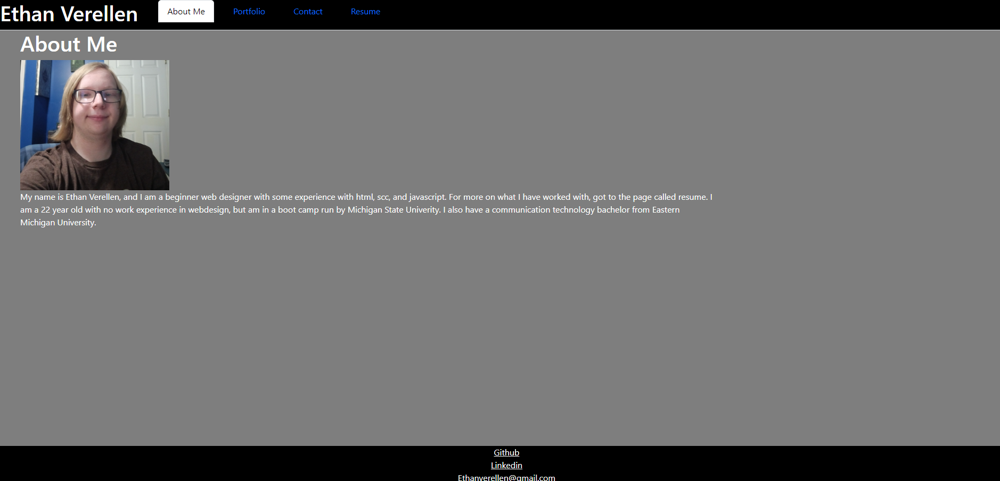
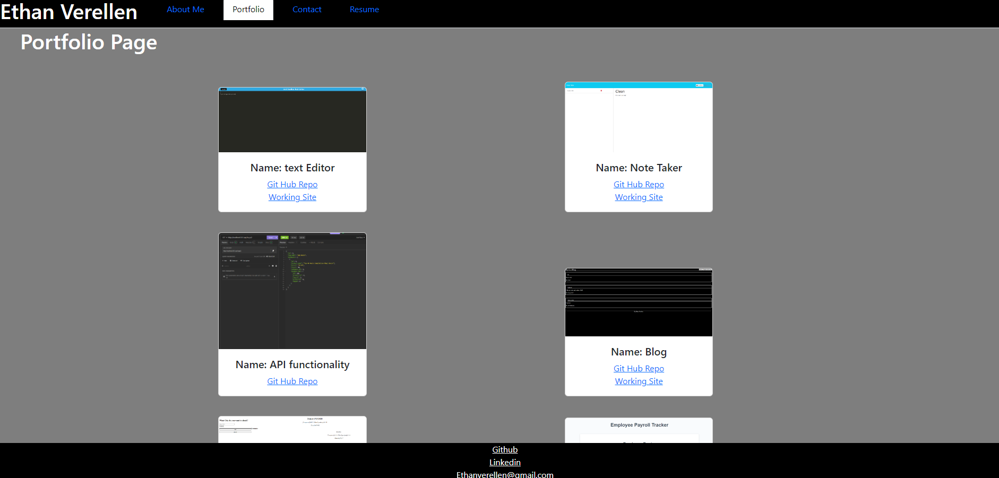
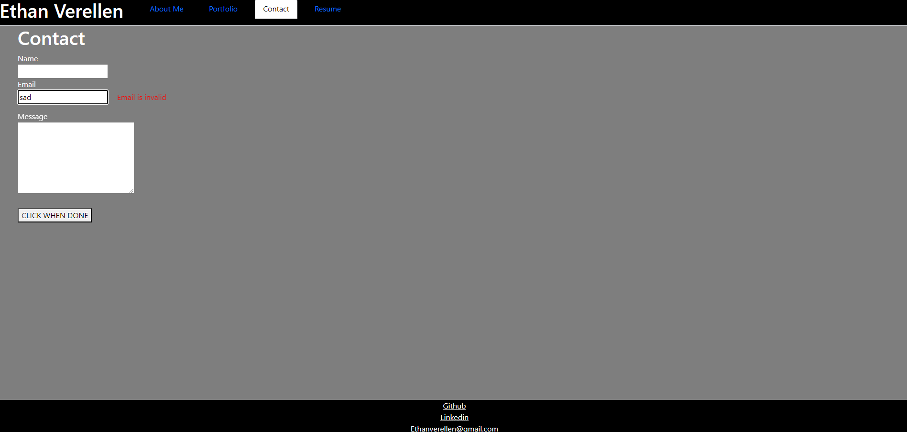
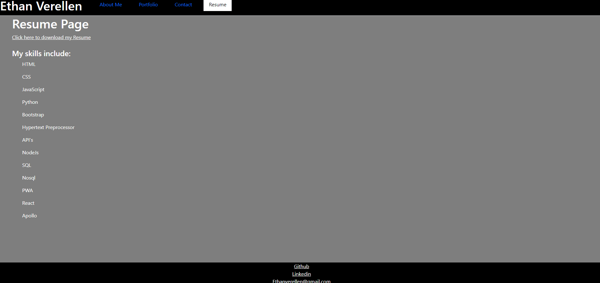

# Ethan-s-React-portfolio

by Ethan Verellen

## Table of Contents

[Description](#description)

[Useage](#useage)

[Installation](#installation)

[Visuals](#visuals)

[Tests](#tests)

[Contributors](#contributors)

[Links](#links)

[Questions](#questions)

## Description

It is a React based Website that should work as a portfolio

## Useage

To use this project, there are 2 simple steps.  Step 1 you need to go to the terminal and once at the main location of the project type npm i.  Then type npm run dev.  The site Should be fully functional

## Installation

To install, Either download as a zip file from the repo, or git clone in gitbash or other equivelences.

## Visuals

## Tests

 Go to https://main--stellular-begonia-7c1893.netlify.app/ and look around it.  The images do not work for some reason

## Contributing

Ethan Verellen

## Links

https://github.com/Ethan-Verellen/Ethan-s-React-portfolio

## Questions

https://github.com/Ethan-Verellen

ethanverellen@gmail.com
